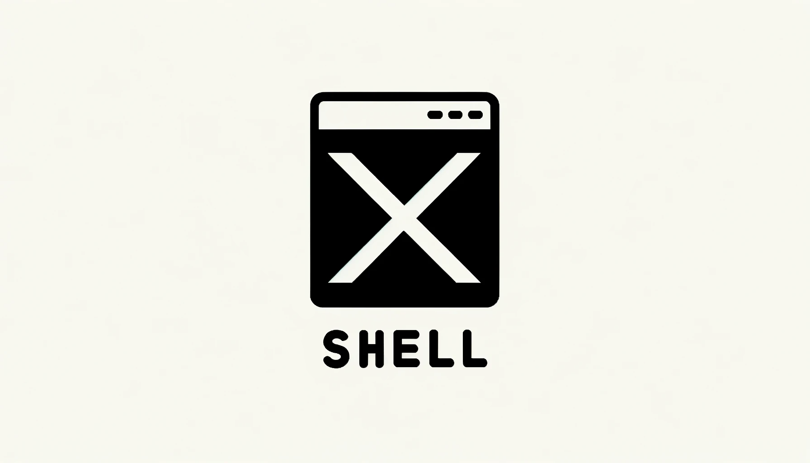

  
   
  
<i>Lightweight C2 for pentesting and adversarial emulation</i>

   

# About
xShell is a Command & Control (C2) application that's all about efficiency and simplicity. It's lightweight and straightforward, making it a solid choice in the C2 toolkit. Like many other C2's, xShell uses HTTPS for its beaconing, hiding communication data within the HTTP request.

# Features
- Multi-operator teamserver with mTLS for authentication and encryption
- Dynamic payload builds
- Indirect syscalls for AV/EDR evasion
- Serpent encrypted call backs
- Multi-platform support (in beta, expect bugs)
- User audit log for reporting

# Planned Features
- Mikikatz implant feature
- Responder implant feature
- Postgres database backend
- dll implant
- Shellcode implant
- C implant variant

# Usage
- Work in progress

# License
 This work is licensed under a <a rel="license" href="http://creativecommons.org/licenses/by-nc-nd/4.0/">Creative Commons Attribution-NonCommercial-NoDerivs 4.0 Unported License</a>.